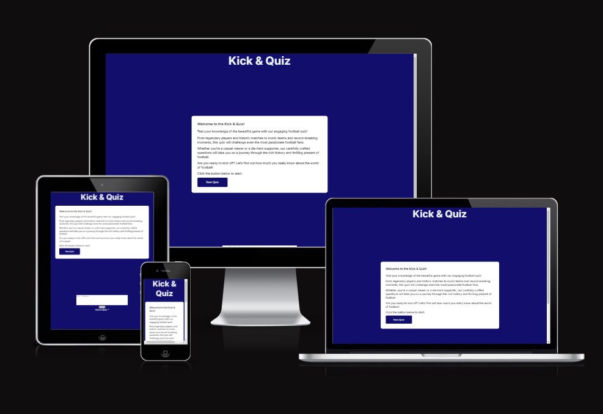
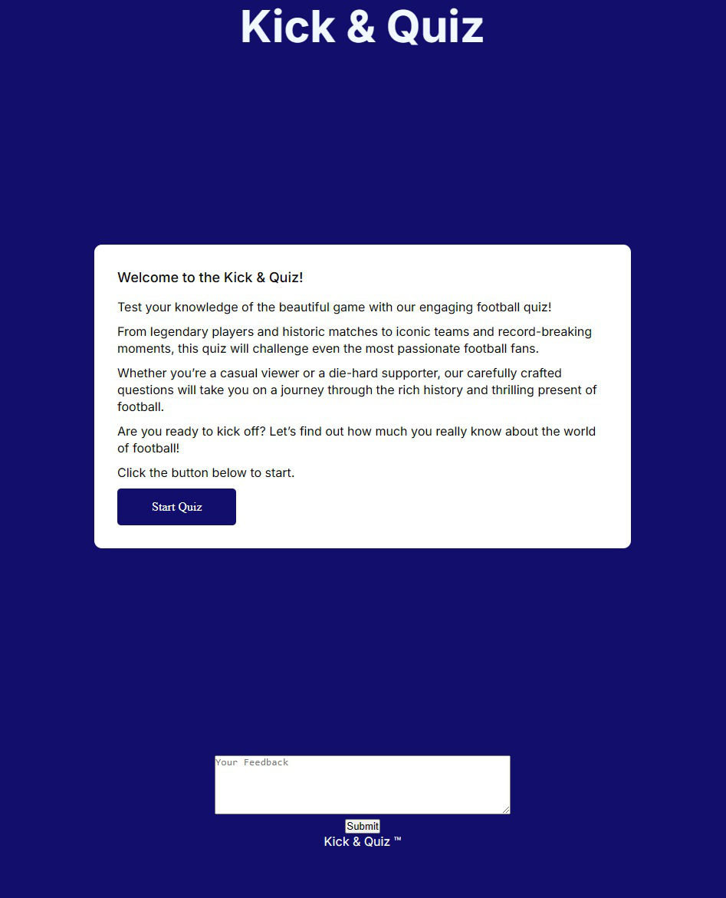
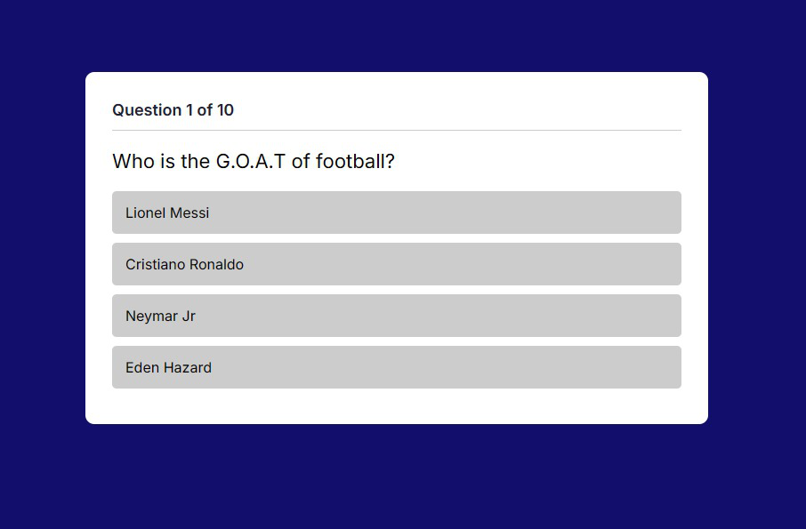
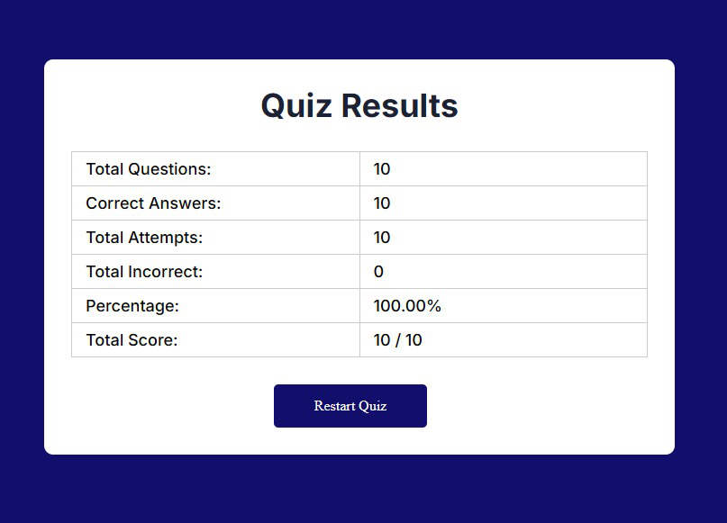

# Kick & Quiz

The Football Quiz Website is an engaging and interactive platform designed for football enthusiasts to test their knowledge about the sport. Whether you're a casual fan or a die-hard supporter, this quiz offers a fun way to challenge yourself with a variety of questions covering famous players, leagues, tournaments, and historical moments in football.

With a sleek design and user-friendly interface, players can easily navigate through questions, track their scores, and replay the quiz for a chance to improve their results. This project showcases the power of web technologies and is a testament to the love of football. Join the fun and see how well you know the beautiful game!

The live link can be found here - [Kick & Quiz](https://esteban-jr.github.io/Kick-Quiz/)

## Features

### Existing Features

- Interactive quiz with multiple-choice questions
- Score tracking to see how well you did
- Responsive design for mobile and desktop devices
- Fade-in animations for a smooth user experience
- Restart functionality to retake the quiz

### Home Page

The home page serves as the welcoming entry point for users, designed with a clean and visually appealing layout. It features an inviting header that introduces the quiz and encourages users to participate.

Key elements of the home page include:
- **Quiz Title**: A prominent title that captures the essence of the quiz and its focus on football.

- **Instructions**: Brief instructions explaining how to start the quiz and what to expect, ensuring that users feel comfortable and informed before they begin.

- **Start Quiz Button**: A clearly labeled button that invites users to dive straight into the quiz, enhancing the user experience with a simple call-to-action.

The home page is responsive, ensuring that users on mobile devices have an equally enjoyable experience. With its friendly design and intuitive navigation, the home page sets the tone for an engaging quiz experience.

### Quiz Section

The quiz section is the heart of the Football Quiz website, where users engage with a series of carefully curated multiple-choice questions that test their knowledge of football. This interactive segment is designed to be both fun and challenging, providing an enjoyable experience for users of all skill levels.

Key Features of the Quiz Section:

- **Dynamic Question Display**: Each question is presented clearly, along with multiple answer options, allowing users to easily read and select their responses. The current question number and total number of questions are displayed at the top, helping users keep track of their progress.

- **Interactive Options**: Users can click on their chosen answer, which triggers immediate feedback. Correct answers are highlighted in green, while incorrect ones are marked in red, enhancing the learning experience by reinforcing correct knowledge.

- **Next Question Navigation**: After answering a question, users can proceed to the next one with a "Next Question" button, which becomes visible only after an answer is selected. This feature keeps the quiz flowing smoothly and encourages users to stay engaged.

- **Final Results Display**: Upon completion of the quiz, users are taken to a results page that summarizes their performance, including the total number of questions, correct answers, and percentage score. This allows users to reflect on their performance and strive for improvement.

The quiz section is designed with user experience in mind, featuring responsive design and engaging animations that create a seamless transition between questions, making the learning process enjoyable and interactive.

### Result Section

The Results Box provides users with a comprehensive summary of their performance after completing the quiz. It serves as a pivotal moment in the quiz experience, allowing players to reflect on their knowledge and see how well they did.

Key Features of the Results Box:

- **Score Summary**: The results box prominently displays the user’s total score, showing the number of correct answers out of the total questions. This clear presentation helps users quickly gauge their performance.

- **Detailed Breakdown**: In addition to the overall score, the results box includes a detailed breakdown of the quiz results, showcasing:
  - Total Questions: The total number of questions presented during the quiz.
  - Correct Answers: How many questions the user answered correctly.
  - Total Attempts: The total number of questions the user attempted, including both correct and incorrect answers.
  - Total Incorrect: A count of the questions answered incorrectly, providing insights into areas for improvement.
  - Percentage Score: A calculated percentage reflecting the user’s success rate, which can motivate users to improve their knowledge.

- **Replay Option**: Users are presented with the option to restart the quiz directly from the results box. This encourages further engagement and allows them to challenge themselves to achieve a higher score.

- **Visual Design**: The results box is styled to be visually appealing and easy to read, with clear typography and layout. This enhances the user experience and ensures that the information is accessible.

The Results Box not only serves as a conclusion to the quiz but also as a motivational tool, encouraging users to learn more about football and improve their scores in future attempts.